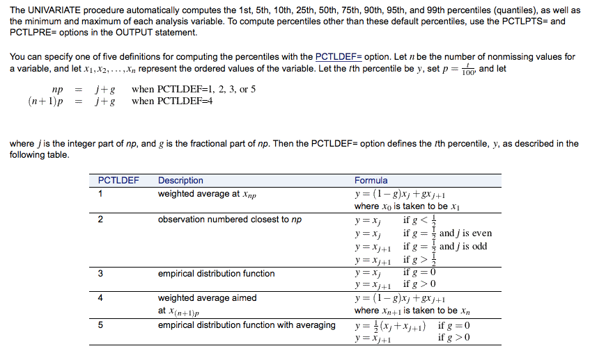
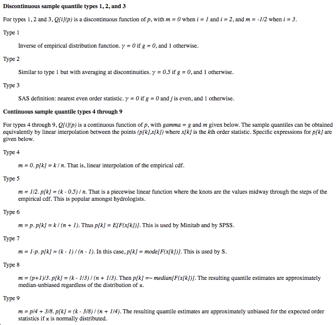

quantile
======

Software-agnostic (re)implementations (R/SAS/Python/C) of common quantile estimation algorithms.
---

**About**

This source code material is intended to promote software/language-agnostic development and deployment of statistical processes, as presented in [Grazzini and Lamarche's article](#References). 

<table align="center">
    <tr> <td align="left"><i>documentation</i></td> <td align="left">available at: https://gjacopo.github.io/quantile/</td> </tr> 
    <tr> <td align="left"><i>version</i></td> <td align="left">0.9</td> </tr> 
    <tr> <td align="left"><i>since</i></td> <td align="left">Thu Jan  5 10:22:03 2017</td> </tr> 
    <tr> <td align="left"><i>license</i></td> <td align="left"><a href="https://joinup.ec.europa.eu/sites/default/files/eupl1.1.-licence-en_0.pdfEUPL">EUPL</a>  <i>(cite the source code or the reference above!)</i> </td> </tr> 
</table>

**Rationale**

We consider here the implementation of [quantile estimates](http://www.math.ntu.edu.tw/~hchen/teaching/LargeSample/notes/noteorder.pdf) based on order statistics. 
Although _quantiles_ are often implemented throughout various packages of statistical software ([`R`](https://www.r-project.org), [`Python`](https://www.python.org), [`SAS`](http://www.sas.com/), Stata, Maple,…), the different implementations may not be consistent with each other and, therefore, provide different output estimates. 
Typically, this happens because different estimation methods are available in the [literature](http://mathworld.wolfram.com/Quantile.html), and each one of them corresponds to a specific implementation. 

Let us consider for instance the implementations available in both `R` and `SAS` software. We consider below the documentations available for the `R quantile` function and the `SAS UNIVARIATE` procedure respectively: 
<table>
<tr>
<td><kbd> </kbd></td>
<td><kbd> </kbd></td>
</tr>
</table>
from whith it appears that there is not one-to-one correspondance between the algorithms implemented :
<small>
<table align="center" style="width: 100%;">
   <tr> <td align="centre">algorithm</td>
        <td>H&amp;F &num;1</td><td>H&amp;F &num;2</td><td>H&amp;F &num;3</td><td>H&amp;F &num;4</td><td>H&amp;F &num;5</td><td>H&amp;F &num;6</td><td>H&amp;F &num;7</td><td>H&amp;F &num;8</td><td>H&amp;F &num;9</td><td>C</td><td>F</td>
   </tr>
   <tr> <td align="centre"><code>quantile type</code></td>
         <td>1</td><td>2</td><td>3</td><td>4</td><td>5</td><td>6</td><td>7</td><td>8</td><td>9</td><td><i>n.a.</i></td><td><i>n.a.</i></td>
    </tr>
    <tr> <td align="centre"><code>UNIVARIATE PCTLDEF</code></td>
         <td>3</td><td>5</td><td>2</td><td>1</td><td> <i>n.a.</i></td><td>4</td><td> <i>n.a.</i></td><td> <i>n.a.</i></td><td> <i>n.a.</i></td><td> <i>n.a.</i></td><td> <i>n.a.</i></td>
    </tr>
    <tr> <td align="centre"><code>mquantiles</code> (&alpha;,&beta;)</td>
         <td>(0,1)</td><td>(0,1)</td><td> (-.5, -1.5)</td><td>(0,1)</td><td> (.5,.5) </td><td>(0,0)</td><td> (1,1)</td><td> (1/3,1/3)</td><td> (3/8,3/8)</td><td> (.4,.4)</td><td> (.5,.5)</td>
    </tr>
</table>  
</small>

|     estimation algorithm        | `quantile type` | `UNIVARIATE PCTLDEF` |  `Python mquantiles` (&alpha;,&beta;) |
|:--------------------------------|:---------------:|:--------------------:|:---------------------:|
| Hyndman and Fan's algorithm \#1 |        1        |           3          |         (0,1)         |
| Hyndman and Fan's algorithm \#2 |        2        |    5 (**default**)   |         (0,1)         |
| Hyndman and Fan's algorithm \#3 |        3        |           2          |      (-.5, -1.5)      | 
| Hyndman and Fan's algorithm \#4 |        4        |           1          |         (0,1)         | 
| Hyndman and Fan's algorithm \#5 |        5        |         _n.a._       |        (.5,.5)        | 
| Hyndman and Fan's algorithm \#6 |        6        |           4          |         (0,0)         |
| Hyndman and Fan's algorithm \#7 | 7 (**default**) |         _n.a._       |         (1,1)         |
| Hyndman and Fan's algorithm \#8 |        8        |         _n.a._       |       (1/3,1/3)       |
| Hyndman and Fan's algorithm \#9 |        9        |         _n.a._       |       (3/8,3/8)       |
| Cunnane's algorithm             |      _n.a._     |         _n.a._       | (.4,.4) (**default**) |
| Filliben's  algorithm           |      _n.a._     |         _n.a._       |        (.5,.5)        |

and, above all, the default values for the selection of the 
**Description**

We propose to go back to the original algorithms and provide with a canonical implementation of quantile estimates on different software platforms and/or using different programming languages. In practice, we implement 10 algorithms, 9 derived from Hyndman and Fan's framework, plus 1 described in Cunnane's article and 1 proposed by Filiben (see references [below](#References)), in `R`, `Python`, `C` and `SAS`. To do so, we either extend/complement (wrap) already existing implementations for quantile estimation (`R` [function `quantiles`](http://stat.ethz.ch/R-manual/R-devel/library/stats/html/quantile.html), `Python` [method `mquantiles`](http://docs.scipy.org/doc/scipy/reference/generated/scipy.stats.mstats.mquantiles.html), `C` [function `gsl_stats`](https://www.gnu.org/software/gsl/manual/html_node/Median-and-Percentiles.html), or `SAS` [procedure `UNIVARIATE`](http://support.sas.com/documentation/cdl/en/procstat/66703/HTML/default/viewer.htm#procstat_univariate_syntax01.htm)), or actually reimplement the algorithm from scratch (`SAS`, `C` and `Python`).

We further implement microservices (SOA) that run the quantile estimation through a web interface.

**References**

* Grazzini J. and Lamarche P. (2017): [**Production of social statistics... goes social!**](https://www.conference-service.com/NTTS2017/documents/agenda/data/abstracts/abstract_124.html), in _Proc.  New Techniques and Technologies for Statistics_.
* Hyndman, R.J. and Fan, Y. (1996): [**Sample quantiles in statistical packages**](https://www.amherst.edu/media/view/129116/original/Sample+Quantiles.pdf), _The American Statistician_, 50(4):361-365, doi:[10.2307/2684934](http://www.jstor.org/stable/2684934)
* Cunnane, C. (1978): [**Unbiased plotting positions: a review**](http://www.sciencedirect.com/science/article/pii/0022169478900173), _Journal of Hydrology_, 37(3-4):205-222, doi:[10.1016/0022-1694(78)90017-3](https://dx.doi.org/10.1016/0022-1694(78)90017-3).
* Filliben, J.J. (1975): [**The probability plot correlation coefficient test for normality**](http://www1.cmc.edu/pages/faculty/MONeill/Math152/Handouts/filliben.pdf), _Technometrics_, 17(1):111-117, doi:[10.2307/1268008](https://dx.doi.org/10.2307/1268008).
