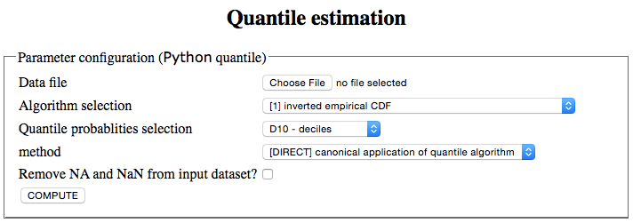
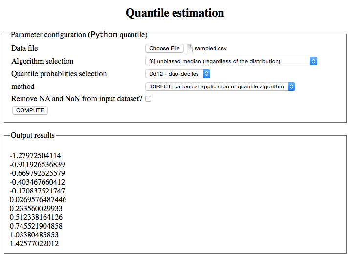

##### Micro web-service

`app_quantile`: Simple web-service that runs configurable estimation of empirical quantiles over a sample data file. 

###### `Python`-based web-service

We create a very basic (_quick & dirty_) web interface to the quantile estimation algorithm implemented in [syntax](syntax.md#python_quantile).
To do so, it is only needed to install [Flask](http://flask.pocoo.org/). 

**Description of the program**

The web application is the `app` object of class `Flask` that appears in the source program `app_quantile.py`. When launched (see [below](#Running)), this application renders a HTML page which looks that the figure below:

and which is configured through the template page `templates/index.html`.

Input parameters of the quantile estimation are provided through a data model. This model is a special `Flask` class named `QuantileForm` derived from `FlaskForm` class. Namely, all the variables of the app are listed as static class attributes and initialised by a special form field object (from the `wtforms` package). Such form field objects correspond to HTML forms in the input page. 

Data are presented to the user through a specific view. The view part of  `app_quantile.py` is given by the function `index` (and the decorator `@app.route`) which is called every time the web-application URL is invoked. 

 **Running the service**

It is enough to launch the `app_quantile.py` program to run the web-application on your "local server" (_i.e._, localhost). This will generally look like:

~~~bash
> python app_quantile.py
 	* Running on http://127.0.0.1:5000/ (Press CTRL+C to quit)
 	* Restarting with stat
~~~

Open a new window or tab in your browser and type in the URL **http://127.0.0.1:5000** to have the display page of the quantile estimation web-application. Then provide with the input dataset and configure the parameters of the estimation:

Our application uses the same page for grabbing input from the user and presenting the result of the quantile 
estimation. This will render like below:

###### `R`-based web-service

###### `Python`-based REST API
