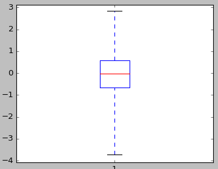

## Usage

### `SAS` programs

Compute the quartiles of a randomly generated vector (with normal distribution) using default parameters of the `quantile` function:
~~~sas
DATA test;
DO i = 1 TO 1000;
  x = rand('NORMAL');
  output;
END;
DROP i;
RUN;

%quantile(x, idsn = test, _quantiles_ = q_x);

%PUT &q_x;
~~~

Do change the algorithm used for estimation:
~~~sas
%quantile(x, type = 5, idsn = test, _quantiles_ = q_x);

%PUT &q_x;
~~~

Now compute the quintiles:
~~~sas
%quantile(x, probs = 0.2 0.4 0.6 0.8, idsn = test, _quantiles_ = q_x);

%PUT &q_x;
~~~

### `Python` programs

Compute the quartiles of a randomly generated vector (with normal distribution) using default parameters of the `quantile` function:
~~~py
>>> import numpy as np
>>> x = np.random.rand(1000)
>>> from quantile import quantile
>>> q = quantile(x)
>>> print(q)
	[ 0.10668975  0.19514584  0.33299627  0.53016722  0.89982259]
~~~

Do change the algorithm used for estimation:
~~~py
>>> q = quantile(x, typ=5)
>>> print(q)
	[ 0.10668975  0.19323867  0.33299627  0.54542127  0.89982259]
~~~

Now compute the quintiles:
~~~py
>>> q = quantile(x, probs=[0., .2, .4, .6, .8, 1.])
>>> print(q)
	[ 0.10668975  0.17672622  0.21760127  0.45610321  0.60035713  0.89982259]
~~~

Consider comparing the results obtained using both already existing `scipy.mquantiles` and the new implementation:
~~~py
>>> probs = [0., .2, .4, .6, .8, 1.]
>>> typ = 8
>>> q1 = quantile(x, probs=probs, typ=typ, method='DIRECT')
>>> print(q1)
	[0.10668975  0.14370132  0.21388262  0.46239251  0.71022886  0.89982259]
>>> q2 = quantile(x, probs=probs, typ=typ, method='INHERIT')
>>> print(q2)
	[0.10668975  0.14370132  0.21388262  0.46239251  0.71022886  0.89982259]
~~~

It is possible to run ("call") exactly the same estimations on an input file of sampled data, _e.g._:
~~~py
>>> ifile = "tests/sample1.csv"
>>> from io_quantile import IO_Quantile
>>> Q=IO_Quantile(probs=probs, typ=typ, method='DIRECT')
>>> q = Q(ifile)
>>> print(q)
	[-3.71390789 -0.84013745 -0.27581729  0.1972615   0.73643897  2.84320792]
~~~

An instance of the class `IO_Quantile` is associated to one possible configuration of the quantile estimation. Usually, you will define another instance to perform the estimation with different parameters, _e.g._ using specialised quantiles:
~~~py
>>> probs = "V20"
>>> Q=IO_Quantile(probs=probs, typ=7)
>>> q = Q(ifile)
>>> print(q)
	[-1.77201688 -1.35332892 -1.02227673 -0.8369087  -0.65649296 -0.52217107
 	-0.40274654 -0.27525036 -0.17099489 -0.02049303  0.07102564  0.1971682
  	0.3350732   0.4536729   0.58860973  0.73606624  0.92265672  1.16084927
  	1.51058281]
~~~

But then it is possible to run the same estimation algorithm over different input files using that same, already defined, instance:
~~~py
>>> ifile2 = "tests/sample2.csv"
>>> q2 = Q(ifile2)
>>> print(q2)
	[-1.50530344 -1.1758764  -0.97947549 -0.82893958 -0.67830867 -0.52803119
 	-0.38669867 -0.27675766 -0.15487459 -0.01350255  0.13391096  0.27587611
 	0.40033506  0.54753533  0.68432219  0.84362724  1.05800707  1.34756166
  	1.73445305]
~~~

Note the definition of the `IO_Quartile` class that specifically runs estimation of quartiles, and also enables you to plot the associated boxplot:
~~~py
>>> from matplotlib import pyplot
>>> from io_quantile import IO_Quartile
>>> Qu=IO_Quartile(typ=7); 
>>> q = Qu(ifile)
>>> print(q)
	[-3.71390789 -0.65649296 -0.02049303  0.58860973  2.84320792]
>>> Qu.plot(ifile)
>>> pyplot.show()
~~~

### `R` programs
