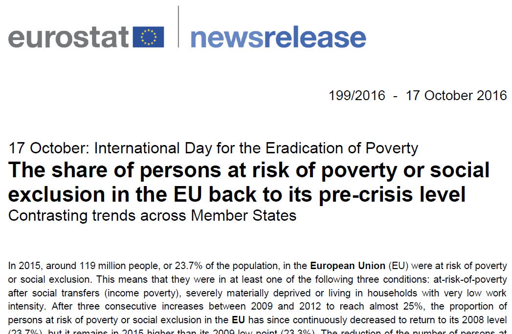

## AROPE_press_news {#sas_AROPE_press_news}
Perform ad-hoc extraction for Eurostat press release on _AROPE_ on the occasion of the 
_International Day for the Eradication of Poverty_. 

	%AROPE_press_news(year, year_ref=, geo=, idir=, ilib=, odsn=, olib=);

### Arguments
* `year` : a (single) year of interest;
* `year_ref` : (_option_) reference year; default: `year_ref=2008`;
* `geo` : (_option_) a list of countries or a geographical area; default: `geo=EU28`;
* `ilib` : (_option_) name of the input library where to look for _AROPE_ indicators (see 
	note below); incompatible with `idir`; by default, `ilib` will be set to the value 
	`G_PING_LIBCRDB` (_e.g._, library associated to the path `G_PING_C_RDB`); 
* `idir` : (_option_) name of the input directory where to look for _AROPE_ indicators 
	passed instead of `ilib`; incompatible with `ilib`; by default, it is not used; 
* `odsn` : (_option_) generic name of the output datasets; default: `odsn=PC_POP_AROPE`;
* `olib` : (_option_) name of the output library; by default, when not set, `olib=WORK`;

### Returns
Three datasets are generated:
* `&odsn._FIGURES_&yy` contains the _AROPE_ table with shares and total population,
* `&odsn._COMPONENTS_&yy` contains the _AROPE_ shares as well as its components 
	(_ARP_, _SMD_, _LWI_) shares for both years of interest `&year` and of reference 
	`&year_ref`,
* `&odsn._SERIES_&yy` contains the evaolution of _AROPE_ shares as well as its 
	components from year of reference `&year_ref` till `&year`,

(where `yy` represents the last two digits of `year`) all stored in the library passed
through `olib`.

### Example
In order to (re)generate the tables `PC_POP_AROPE_FIGURES_15`, `PC_POP_AROPE_COMPONENTS_15` 
and `PC_POP_AROPE_SERIES_15`, used for the tables of the 2015 press release below: 

you can simply launch:

	%AROPE_press_news(2015);
	%ds_export(PC_POP_AROPE_FIGURES_15, fmt=csv);
	%ds_export(PC_POP_AROPE_COMPONENTS_15, fmt=csv);
	%ds_export(PC_POP_AROPE_SERIES_15, fmt=csv);

### Note
The publication is based on the following  indicators:
* _PEPS01_ for the extraction of AROPE total shares,
* _LI01_ for the extraction of ARP tresholds,
* _LI02_ for the extraction of ARP shares,
* _MDDD11_ for the extraction of SMD shares,
* _LVHL11_ for the extraction of LWI shares,
* _DI03_ for the extraction of ARP equivalised medians.

### References
1. Website of the UN initiative for the _International Day for the Eradication of Poverty_: 
http://www.un.org/en/events/povertyday.
2. Website of press releases on _AROPE_: 
[2015](http://ec.europa.eu/eurostat/en/web/products-press-releases/-/3-16102015-CP) and
[2016](http://ec.europa.eu/eurostat/documents/2995521/7695750/3-17102016-BP-EN.pdf).

### See also
[%AROPE_press_infographics](@ref sas_AROPE_press_infographics).
