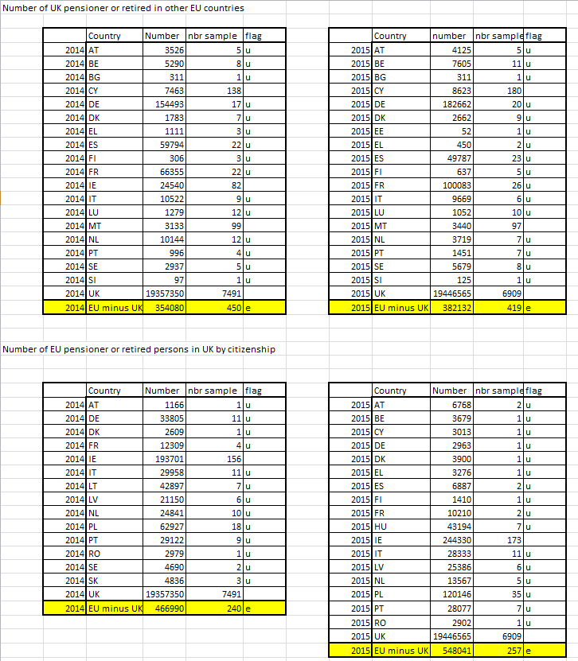

## pension_population_count {#sas_pension_population_count}
Count the number of pensioners and/or retired people of a given citizenship abroad, or in a 
given country by citizenship. 

	%pension_population_count(geo, year, zone=, idir=, ilib=, odsn=, olib=);

### Arguments
* `geo` : a country code whose population is considered: both retired/pensioned people:
		+ with the citizenship of this country,
		+ with any citizenship but living in this country,

	are considered; 
* `year` : year of interest;
* `zone` : (_option_) a list of countries or a geographical area; default: `geo=EU28`;
* `ilib` : (_option_) name of the input library where to look for _AROPE_ indicators (see 
	note below); incompatible with `idir`; by default, `ilib` will be set to the value 
	`G_PING_LIBCRDB` (_e.g._, library associated to the path `G_PING_C_RDB`); 
* `idir` : (_option_) name of the input directory where to look for _AROPE_ indicators passed 
	instead of `ilib`; incompatible with `ilib`; by default, it is not used; 
* `odsn` : (_option_) generic name of the output datasets; default: `odsn=THS_POP`;
* `olib` : (_option_) name of the output library; by default, when not set, `olib=WORK`;

### Returns
9 datasets are generated:
* `&odsn._RET_&geo._IN_FOR_&yy`, `&odsn._PEN_&geo._IN_FOR_&yy` and `&odsn._PENRET_&geo._IN_FOR_&yy` 
	contain the tables with total and sample populations of `geo`-national people (_i.e._ 
	with citizenship `PB220A=&geo`) living "abroad" (any foreign country) and who are 
	_retired_, _pensioned_ and either of those two  (_retired or pensioned_) respectively 
	(grouped by country of residence),
* `&odsn._RET_FOR_IN_&geo._&yy`, `&odsn._PEN_FOR_IN_&geo._&yy` and `&odsn._PENRET_FOR_IN_&geo._&yy` 
	contain the tables with total and sample populations of foreign people living in `geo` 
	(_i.e._ `PB020=geo`) and who are _retired_, _pensioned_ and either of those two 
	respectively (grouped by country of citizenship),
* `&odsn._RET_ZONE_IN_&geo._&yy`, `&odsn._PEN_ZONE_IN_&geo._&yy` and `&odsn._PENRET_ZONE_IN_&geo._&yy` 
	contain the tables with total and sample aggregated populations of foreign `zone`-national 
	people living in `geo` (_i.e._ with citizenship `PB220A in &zone`, at the exclusion of 
	`geo`, and `PB020=&geo`) and who are _retired_, _pensioned_ and either of those two 
	respectively (aggregated figure),

(where `yy` represents the last two digits of `year`, and with `odsn` and `geo` upcased when not 
already) all stored in the library passed through `olib`.

### Example
In order to generate the tables `POP_PENRET_FOR_IN_UK_14` and `POP_PENRET_UK_IN_FOR_14` 
of total populations of, respectively, foreign _pensioned or retired_ people living in UK and UK-national
_pensioned or retired_ people living abroad, and similarly for 2015, like in the request below:

you can simply launch:

	%pension_count(2014, UK, zone=EU28);
	%ds_export(THS_POP_PENRET_FOR_IN_UK_14, fmt=csv);
	%ds_export(THS_POP_PENRET_UK_IN_FOR_14, fmt=csv);
	%pension_count(2015, UK, zone=EU28);
	%ds_export(THS_POP_PENRET_FOR_IN_UK_15, fmt=csv);
	%ds_export(THS_POP_PENRET_UK_IN_FOR_15, fmt=csv);

then similarly with year 2015. 

### Note
The status of a personed is evaluated as:
* _retired_ when `PL031 = 7`,
* _pensioned_ when `(PY035G>0 or PY080G>0 or PY100G>0 or PY110G>0)`,
* either _retired or pensioned_ when any of the cases above occurs.
