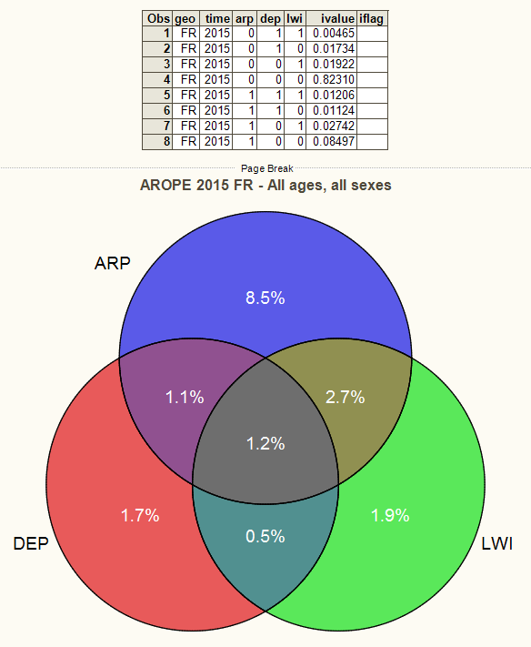

## AROPE_plot_venn {#sas_AROPE_plot_venn}
Create a 3-way (non-proportional) Venn diagram of _AROPE_ and its components. 

	%AROPE_plot_venn(year, geo=, ind=, idir=, ilib=, ofn=, odir=, unit=, title=, 
					age=, sex=, wstatus=, quantile=, hhtyp=, isced11=, citizen=, c_birth=, tenure=);

### Arguments
* `year` : a (single) year of interest;
* `geo` : (_option_) a list of countries or a geographical area; default: `geo=EU28`;
* `unit` : (_option_) choice of representation: either shares of population (`PC_POP`)
	or absolute figures (`THS_PER`); default: `unit=PC_POP`;
* `ind` : (_option_) indicator to consider for representation in Venn diagram; it can be any
	choices  among: `PEES01, PEES02, PEES03, PEES04, PEES05, PEES06, PEES07, PEES08`; when none
	of the indicator breakdwons is selected, all are represented (_i.e._, one Venn diagram is
	displayed for each breakdown);
* `age, sex, wstatus, quantile, hhtyp, isced11, citizen, c_birth, tenure` : variables whose
	breakdowns are considered for representation in the Venn diagram; those can be: 
		+ `age` in 	 	`TOTAL, Y18-49, Y18-64, Y50-64, Y_GE18, Y_GE65, Y_LT18`,
		+ `wstatus`	in 	`EMP, INAC_OTH, NEMP, POP, RET, SAL, NSAL, UNE`,
		+ `quantile` in `TOTAL, QU1, QU2, QU3, QU4, QU5`,
		+ `hhtyp` in 	`A1, A1F, A1M, A1DCH, A_GE2_NDCH, HH_DCH, HH_NDCH`, 
		+ `isced11` in 	`ED0-2, ED3_4, ED5-8`,
		+ `citizen` in 	`NAT, EU27_FOR, NEU27_FOR, FOR, EU28_FOR, NEU28_FOR`,
		+ `c_birth` in 	`NAT, EU27_FOR, NEU27_FOR, FOR, EU28_FOR, NEU28_FOR`,
		+ `tenure` in 	`RENT, OWN`;	

	the breakdowns are incompatible with each other (except `age` and `sex`) since they are 
	implemented in different indicators; when passing any variable among those, the indicator
	to be represented (see `ind` above) is also automatically set;
* `title` : (_option_) title of the graph; default: set automatically; 
* `idir` : (_option_) name of the input directory where to look for _AROPE_ indicators passed 
	instead of `ilib`; incompatible with `ilib`; by default, it is not used; 
* `ilib` : (_option_) name of the input library where to look for _AROPE_ indicators (see 
	note below); incompatible with `idir`; by default, `ilib` will be set to the value 
	`G_PING_LIBCRDB` (_e.g._, library associated to the path `G_PING_C_RDB`); 
* `ofn, odir` : (_option_) output arguments to be passed to macro [%diagram_venn](@ref sas_diagram_venn).
	
### Example
In order to generate the Venn diagram of _AROPE_ population (in `PC_POP`) like the one below,
where shares are represented for "at risk of poverty" population (`ARP`), "severely materially 
deprived" population (`DEP`), and population with "low work intensity" (`LWI`): 

you can simply launch:

	%AROPE_plot_venn(2015, geo=FR, age=TOTAL, sex=T, unit=PC, title=%bquote(AROPE 2015 FR - All ages, all sexes));

### Note
Launching the example below is (in short) equivalent to running the following instructions/procedures: 

	libname rdb "&G_PING_C_RDB";
	%ds_select(	PEES01, 
				dsn, 
				var=	geo time indic_il ivalue iflag, 
				where=	%str(age="TOTAL" AND sex="T" AND unit="PC_POP" AND time=2015 AND geo=FR), 
				ilib=	rdb,
				olib=	WORK);
	DATA dsn;
		SET dsn;
		IF find(indic_il,"NR") THEN 	ARP=0; ELSE 	ARP=1;
		IF find(indic_il,"NDEP") THEN 	DEP=0; ELSE 	DEP=1; 
		IF find(indic_il,"NLOW") THEN 	LWI=0; ELSE 	LWI=1; 
		ivalue = ivalue/100.;
	run;

	%diagram_venn(dsn, 
				  var=	ARP DEP LWI, 
				  valpct=	ivalue, 
				  label=	("ARP","DEP","LWI"),
				  hover=	("R_NDEP_NLOW","NR_DEP_NLOW","NR_NDEP_LOW","R_NDEP_LOW","R_DEP_NLOW","R_DEP_LOW","NR_DEP_LOW"),
				  title="AROPE Venn diagram",
				  format= percent8.1);

### See also
[%diagram_venn](@ref sas_diagram_venn), [%AROPE_press_infographics](@ref sas_AROPE_press_infographics).
