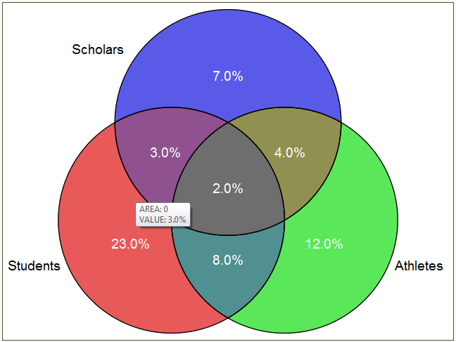

## diagram_venn {#sas_diagram_venn}
Plot 3-way Venn diagrams (using `PROC GMAP`) with values displayed in each set and/or set intersections.

	%diagram_venn(idsn, var=, valpct=, valnum=, valid=, format=, label=, ofn=, odir=, ilib=,
				  hover=, title=, fontSize=4, labelFontSize=4, imgFmt=gif, valColor=white, bgColor=white);;
  
### Arguments
* `idsn` : name of the input dataset containing 3 set indicator variables along with a 4th variable 
	(either a cell count, an id variable or a variable direclty containing the information to be displayed 
	in each set or set intersections); see example below; 	
* `var` : (_option_) lists of set indicator variables, 3 in total; each of these variables is binary, taking 
	value 1 for values in corresponding set, 0 for values outside of the corresponding set;	when not passed,
	the 3 first variables of `idsn` dataset are retrieved (_i.e._, by `varnum` order) assuming they are 
	correctly formatted;
* `valpct` : (_option_) if `idsn` consists of 3 set indicator variables and a variable (which could be a text 
	variable) to be displayed on the plot, specify the corresponding variable name throught the `valpct` 
	argument; this option is incompatible with options `valnum` and `valid` below;
* `valnum` : (_option_) if `idsn` already consists of cell counts to be displayed on the plot, then the 
	variable where these cell counts can be found must be specified through the `valnum` argument; this option 
	is incompatible with options `valpct` above and `valid` below;
* `valid` : (_option_) if `idsn` consists of a series of observations (patients) with an ID variable and 3 
	set indicator variables, then the ID variable should be specified through the `valid` argument; this option 
	is incompatible with options `valpct` and `valnum` above;	
* `format` : (_option_) SAS format in which values printed in each set should be displayed; default is 
	`percent8.1` when `valpct` is set, `8.1` otherwise;
* `ofn` : (_option_) name of the `.html` output file to be saved; an image will also be saved with the 
	same name, with file extension as defined by `imgFmt` (see below); by default, no file is saved;
* `odir` : (_option_) path of the directory where output `.html` file and image (with generic name `ofn`) shall
	be saved; obviously ignored when `ofn` is not passed;
* `title` : (_option_) title to be displayed on top of the plot; default is "Venn Diagram - <idsn>", where 
	<idsn> stands for the name of the input dataset `idsn`;
* `label` : (_option_) labels (3 in total) to be printed next to each set; default is to use each set indicator 
	variable names available through `var`; 
* `hover` : (_option_) formatted list of quoted items which contain text to be displayed when hovering over 
	each set or set intersections with the mouse; the order of display in `hover` is given by the sequence: 
	`1 2 3 12 23 13 123` where the number indicates the order of the variables in `var` which is concerned by 
	the set or set intersection; in particular, `hover` must be of length 7 (number of sets in the Venn diagram); 
	by	default, `hover` is the concatenation of the corresponding set label(s);
* `fontSize` : (_option_) font size for values to be displayed in each set or set intersections; default: 4;
* `labelFontSize` : (_option_) font size for set labels; default: 4;
* `imgFmt` : (_option_)image format; default: `imgFmt=gif`; an alternative is `png`;
* `valColor` : (_option_)color of values displayed in sets; default: `valColor=white`.
* `bgColor` : (_option_)background color; default: `bgColor=white`;
* `ilib` : (_option_) name of the input library; by default: empty, _i.e._ `WORK` is used.

### Example
We provide here an example presented in the original code (see note below).

Given the table `Example` in `WORK`ing library:

	DATA Example;
	    input Scholars Students Athletes p;
	cards;
	1 0 0 0.07
	0 1 0 0.23
	0 0 1 0.12
	1 1 0 0.03
	0 1 1 0.08
	1 0 1 0.04
	1 1 1 0.02
	;
	run;

then running:

	%diagram_venn(Example, var=Scholars Students Athletes, valpct=p, format=percent8.1);

will produce the following graphical result:

Run macro `%%_example_diagram_venn` for examples.

### Notes
1. **The macro `%%diagram_venn` is  a wrapper to L. Joseph's original `%%VennDiagram` macro which
implements a 3-Way non-proportional Venn diagram**. 
Original source code (no license, no disclaimer) is available at 
<http://www.medicine.mcgill.ca/epidemiology/joseph/pbelisle/VennDiagram.html>.
2. This macro creates Venn diagram using SAS/Graph `PROC GMAP` where each segment of the Venn diagram
is a totally separate map area, so the color/drilldown/etc of each piece can be controlled separately.

### References
1. Allison R. [webpage](http://robslink.com/SAS/democd14/aaaindex.htm) on SAS/Graph samples from which
the code is derived.
2. Harris, K. (2008): ["How to generate 2, 3 and 4 way Venn diagrams with drill down functionality within 4 minutes!"](http://www2.sas.com/proceedings/forum2008/073-2008.pdf).
3. Li, S. (2009): ["Customized proportional Venn diagrams from SAS system"](http://www.lexjansen.com/nesug/nesug09/ap/AP11.pdf).
4. Kruger, H. (2011): ["Creating proportional Venn diagrams using Google and SAS"](Creating proportional Venn diagrams using Google and SAS).
5. Harris, K. (2008): ["V is for Venn diagrams"](http://support.sas.com/resources/papers/proceedings13/243-2013.pdf).

### See also
[venn](http://robslink.com/SAS/democd14/venn.sas), [vennmap](http://robslink.com/SAS/democd14/vennmap.sas)
[%VennDiagram](http://www.medicine.mcgill.ca/epidemiology/joseph/pbelisle/VennDiagram.html),
[PROC GMAP](http://support.sas.com/documentation/cdl/en/graphref/67881/HTML/default/viewer.htm#n01e0bon6tv6ncn1a7dlrr5fh5tr.htm).
