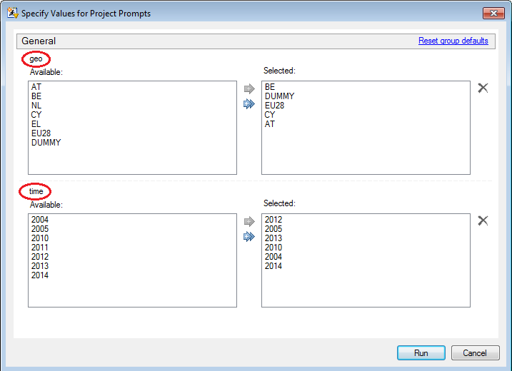

## _egp_geotime {#sas__egp_geotime}
Create the ordered lists of countries and periods from the multiple choices prompt in the client 
SAS EG project (similar to SAS EG version prior to 4.1).

	%_egp_geotime(_time_=, _geo_=, pmultipl=yes);

### Arguments
* `_geo_` : name of the variable associated to the `geo` prompt, _i.e._ the one returned
	from the selection of a list of countries/zones; a prompt with this name must exist;                                             
* `_time_` : (_option_) name of the variable associated to the `time` prompt, _i.e._ the 
	one returned from the selection of periods/years for calculation; a prompt with this 
	name must exist;
* `pmultipl` : (_option_) boolean flag (`yes/no`) set for multiple option selection; default:
	`pmultipl=yes`.

### Returns
* in `&_time_`, the ordered list of periods;
* in `&_geo_`, the updated list of countries/zones, where the zones appear at the end.                                                             

### Example
Given the following prompt (with multiple selections) and the corresponding selections:

where the names of the prompt have been set respectively (from top to bottom, highlighted in red) 
to `geo` and `time`, the call:

	%_egp_geotime(_time_=time, _geo_=geo, pmultipl=yes);

will return: `geo=BE CY AT EU28` (`DUMMY` not selected and `EU28` put at the end of the list)
and `time=2004 2005 2010 2012 2013 2014` (list ordered).

### See also
[%_egp_prompt](@ref sas__egp_prompt), [%list_sort](@ref sas_list_sort),
[%_run_geotime](@ref sas__run_geotime).
