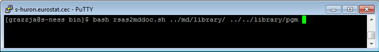
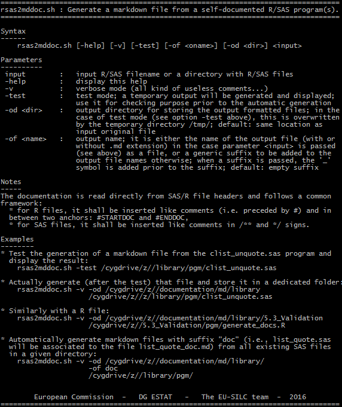

## Documenting {#mainpage_documenting}

The purpose of an adequate documentation is to enable the produser to (re)use, extend, share and migrate 
a program. It is also essential for business and processes modeling. 

For that purpose, we adopt a standardised way for appropriately document `PING` programs and processes.
In practice, an "inline" documentation:
* adopts [markdown](https://daringfireball.net/projects/markdown/) language,
* is systematically inserted as comments directly inside the programs, in the header,

and is then automatically extracted so as to create a user-friendly browsable "online" documentation 
using [doxygen](http://www.stack.nl/~dimitri/doxygen/) documentation generator. 

We provide hereby guidelines and templates for actually documenting:
* [SAS programs](@ref SASdoc) (_e.g._ macros), and 
* [R programs](@ref Rdoc) (_e.g._ functions),

and we indicate as well how to automatically [generate the documentation](@ref htmldoc).

### Document SAS programs {#SASdoc}
### Document SAS programs
As mentioned above, the documentation of SAS programs is inserted in the header of the program as a comment. 
More precisely, we impose that:
* **the documentation (markdown language) shall be inserted in between the symbols: `/**` and `*/`**.

Further, we also require that:
* **the core program (SAS code) shall be inserted in between the following anchor marks: `/**` \\cond `*/`
and `/**` \\endcond `*/`**.

You will also need to adopt a common template for documentation:
* the reference used for a program/macro is defined as the **name of the program to which the prefix string `sas_`**
* arguments of a macro shall be listed under the header `### Arguments`,
* outputs shall shall be listed under the header `### Returns`,
* example(s) shall appear after the header `### Example` (`### Examples`),
* note(s) shall appear after the header `### Note` (`### Notes`),
* reference(s) related to the programs/macros shall be listed under `### Reference` (`### References`), 
* all other (`PING` or external) related programs/macros shall appear after the header `### See also`.

The inline documentation of the `ds_create.sas` macro looks like, for instance:
	
	## ds_create {#sas_ds_create}
	Create (using a `PROC SQL`) a dataset/table from a common label template and a list of 
	additional labels.

		%ds_create(dsn, var=, typ=, len=, cds_ind=, clib=, lib=WORK);
	  
	### Arguments
	* `var` : (_option_) labels, i.e. names of the (additional) fields present in the dataset; 
		default: empty;
	* `typ` : (_option_) types of the (additional) fields; must be the same length as `var`;
	* `len` : (_option_) lengths of the (additional) fields; must be the same length as `var`; 
	* `cds_ind` : (_option_) configuration file storing the template for indicator dimensions; 
		by default, it is named after the value `&G_PING_INDICATOR_DIMENSIONS` (_e.g._, 
		`INDICATOR_DIMENSIONS`);
	* `clib` : (_option_) name of the library where the configuration file is stored; default 
		to the value of `G_PING_LIBCFG`(_e.g._, `LIBCFG`) when not set;
	* `lib` : (_option_) name of the output library where `dsn` shall be stored; by default: 
		empty, _i.e._ `WORK` is used.

	### Returns
	`dsn` : name of the final output dataset created. 

	### Examples
	Running for instance

		%let labels=A B C;
		%ds_create(dsn, var=&labels, cds_ind=_NONE_, clib=_NONE_);

	creates the table `dsn` as:
	| A | B | C |
	|---|---|---|
	|   |   |   |  
	where all fields `A, B, C` are of type `CHAR` and length `5.
	Consider now the following table `TEMP` stored in `LIBCFG`:
	LABEL | TYPE | LENGTH | ORDER
	------|------|--------|------
		W | num  |      8 | 1
		X | num  |      8 | 2
		Y | char |     15 | 3
		Z | num  |      8 | -1
	and run the command:

		%ds_create(dsn, var=&labels, cds_ind=TEMP, clib=LIBCFG);

	then the table `dsn` now looks like:
	| W | X | Y | A | B | C | Z |
	|---|---|---|---|---|---|---|
	|   |   |   |   |   |   |   |
	where the variables `W, X, Y, Z` types and lengths are taken from the `TEMP` table.

	Run macro `%%_example_ds_create` for examples.

	### See also
	[%ds_check](@ref sas_ds_check), [%silcx_ind_create](@ref sas_silcx_ind_create).

so that the online documentation is rendered as:

### Document R programs {#Rdoc}
### Document R programs
Similarly, the documentation shall be inserted in the header of the program as a comment, hence
after the `#` symbol. In practice, **you will further need to insert the desired documentation in-between 
two anchors: `#STARTDOC` and `#ENDDOC`** so as to recognise the text as specific to the documentation (and
differentiate from other comments). 

The common template for code documentation is exactly the same as the one used for SAS, with the 
following exceptions: 
* the reference used for a program is defined as the **name of the program to which the prefix string `r_`**
is added (instead of `sas_` above),
* all examples and **code excerpts shall be preceded with the `>` symbol** (like in R console).

As an example, the inline documentation inserted in the `data_extract.R` program looks like:

	#STARTDOC
	### data_extract {#r_data_extract}
	#Extract data from pdb files.
	#
	#    > data_extract(year, ctry, start_folder, out_format)
	#
	#### Arguments 
	#* `year` : the number of years after 2000;
	#* `ctry` : a list of characters with the two letter country codes to extract;
	#* `start_folder` : (_option_) a string with the path to the folder where the pdb files are, 
	# if not provided the current working directory is used `(getwd())`; the folders should be 
	# divided by the "/" character and should end with "/" character.;
	#* `out_format` : (_option_) character `_c_`, `_l_`, or `_r_` what type of data shall be in 
	# the output data frame; it takes the value `_r_` if it is missing.
	#
	#### Returns
	# It provides a list of 4 data frames containing the data from the `d`, `h`, `p`, and `r` 
	# SAS data files.
	#
	#### Examples
	#
	#    > data_extract(14,c("AT","DE","EL"),"z:/pdb/","r")
	#    > data_extract(9,c("AT","DE","EL","CH","UK"),"y:/pdb/","c")
	#ENDDOC

and the online documentation is rendered as:

### Generate the documentation {#htmldoc}
### Generate the documentation
So as to automatically generate the documentation (like this one), you will need:
* a script of extraction of the `markdown` formatted documentation from program files into pure `markdown` 
files,
* a documentation generator that creates the user-friendly browsable documentation from the `markdown` files.

As for the documentation extractor, you can use a bash script (hereby named `rsas2mddoc.sh`) specifically developed 
for this purpose. This ad-hoc program enables you to retrieve automatically the markdown formatted documentation 
inserted in R/SAS files (as described above), and store the resulting excerpts into separated files.
 
This script is located under the documentation folder `documentation\bin`. It works as an inline command:

that can be launched from any terminal so as to generate a bulk of `markdown` files (with `.md` extension) into
the `documentation\md\library` folder. The associated help looks like the following:

The resuiting `markdown` files will look exactly like the headers in your programs with the exception of the `/*` (or `/**`)
and `*/` anchors. Then, [doxygen](http://www.doxygen.org) is the tool used to actually generate the documentation.  The full 
set of guidelines/best practices for running this software is available in the 
[dedicated section](http://www.stack.nl/~dimitri/doxygen/manual/starting.html) of the doxygen website.

 