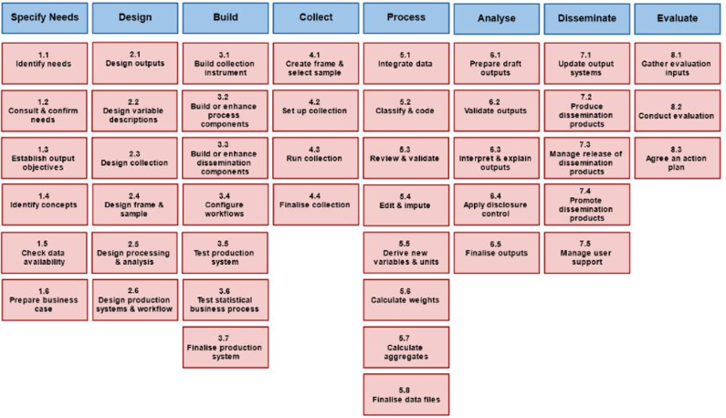

### Organisation {#mainpage_organisation}

The tool organisation follows the common metadata management framework provided by the
_Generic Statistical Business Process Model_ of the UNECE Statistics 
([GSBPM](www.unece.org/stats/gsbpm)).

